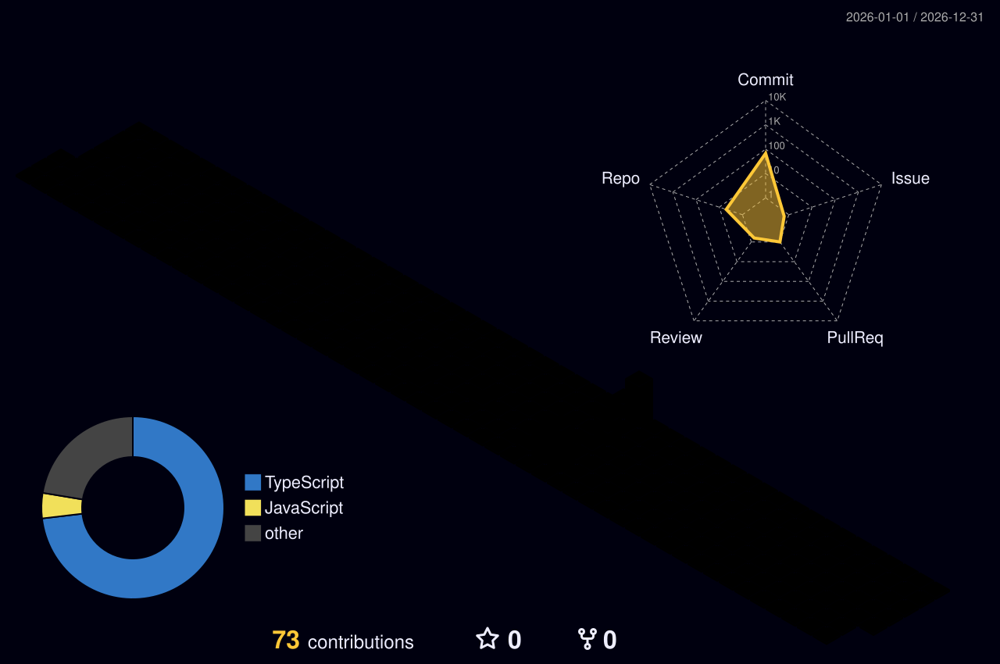

# Hi, I'm Jayvan 👋

 

I build clean, responsive, and user-friendly digital experiences using modern web and mobile technologies.

  

<!--
  Previously: a full-width 3D GitHub contribution graph
  (./profile-3d-contrib/profile-night-rainbow.svg) — the isometric grid +
  radar chart + language donut shown in the screenshot. Replaced below
  with a small looping "developer coding" GIF for a simpler, lighter-weight
  header visual. To bring the contribution graph back, restore:
  
-->

---

## 👨‍💻 About Me

- 💻 I enjoy building **modern, responsive interfaces** and reusable components.
- 🎨 I care about **clean UI, thoughtful UX, and polished interactions**.
- 🚀 I work with both **frontend and backend technologies** to turn ideas into functional products.
- 📱 I build and explore **cross-platform mobile applications**.
- 🛠️ I use modern development tools and workflows to create maintainable projects.
- 🌱 I'm continuously learning and improving my development skills.

---

# 💻 Tech Stack

<table>
  <tr>
    <td width="33%" valign="top">
      <strong>Programming Languages</strong>  
      
    </td>
    <td width="34%" valign="top">
      <strong>Frontend Development</strong>  
      
    </td>
    <td width="33%" valign="top">
      <strong>Backend Development</strong>  
      
    </td>
  </tr>
  <tr>
    <td width="33%" valign="top">
      <strong>Mobile Development</strong>  
      
    </td>
    <td width="34%" valign="top">
      <strong>Databases</strong>  
      
    </td>
    <td width="33%" valign="top">
      <strong>Tools &amp; Platforms</strong>  
      
    </td>
  </tr>
</table>

